# StarInvoice

An invoice-based escrow protocol for freelancers, built on [Stellar](https://stellar.org) using [Soroban](https://soroban.stellar.org) smart contracts.

## Overview

StarInvoice lets freelancers create on-chain invoices and receive payment through a trustless escrow flow. The client funds the invoice, the freelancer marks work as delivered, and funds are released upon approval — no intermediaries needed.

## Status

This project is intentionally minimal. The `create_invoice` function is implemented. All other escrow functions are stubbed with `TODO` comments and open GitHub issues for contributors to pick up.

## ❤️ Support the Project

StarInvoice is maintained by the community. If you find this project useful, consider supporting its development:

[](https://github.com/sponsors/onahiOMOTI)

You can sponsor via **GitHub Sponsors** or other platforms listed in [FUNDING.yml](.github/FUNDING.yml).

## Contract Flow

```
create_invoice → fund_invoice → mark_delivered → approve_payment → release_payment
```

### State Machine

```mermaid
stateDiagram-v2
    [*] --> Pending : create_invoice
    Pending --> Funded : fund_invoice
    Pending --> Cancelled : cancel_invoice
    Funded --> Delivered : mark_delivered
    Funded --> Cancelled : cancel_invoice
    Delivered --> Approved : approve_payment
    Delivered --> Disputed : dispute_invoice
    Disputed --> Approved : resolve_dispute
    Disputed --> Cancelled : resolve_dispute
    Approved --> Completed : release_payment
    Completed --> [*]
    Cancelled --> [*]
```



> Note: `Disputed` and `Cancelled` states are planned — see [issue #5](https://github.com/your-org/StarInvoice/issues/5).

| Function          | Status        |
|-------------------|---------------|
| `create_invoice`  | ✅ Implemented |
| `fund_invoice`    | ✅ Implemented |
| `mark_delivered`  | ✅ Implemented |
| `approve_payment` | ✅ Implemented |
| `release_payment` | ✅ Implemented |

## Architecture

### Overview

StarInvoice is a Soroban smart contract built with a modular architecture that separates concerns into distinct components:

- **Contract Logic** (`lib.rs`): Entry points and business logic
- **State Management** (`storage.rs`): Data structures and on-chain storage
- **Event System** (`events.rs`): Off-chain notifications and logging
- **Constants** (`constants.rs`): Configuration and TTL parameters

The contract follows Soroban's execution model where transactions are atomic—each transaction either completes fully or fails with no side effects.

### Core Modules

#### lib.rs - Contract Entry Points

`lib.rs` contains the main contract implementation with the following responsibilities:

- **Entry Points**: Public functions decorated with `#[contractimpl]` that can be invoked externally
- **Business Logic**: Implements the escrow workflow (create, fund, deliver, approve, release)
- **Authorization**: Uses `require_auth()` to verify that callers are authorized to perform actions
- **State Transitions**: Validates invoice status changes using `validate_transition()`
- **Token Operations**: Invokes token transfers via the Soroban token interface

Key functions:
- `create_invoice()`: Creates a new invoice and stores it on-chain
- `fund_invoice()`: Transfers tokens from client to contract escrow
- `mark_delivered()`: Freelancer signals work completion
- `approve_payment()`: Client approves the delivered work
- `release_payment()`: Transfers escrowed funds to freelancer
- `get_invoice()`: Retrieves invoice data

#### storage.rs - State Management

`storage.rs` handles all on-chain data persistence:

**Data Structures:**
- `Invoice`: Core struct containing invoice metadata (parties, amount, token, status, timestamps)
- `InvoiceStatus`: Enum representing lifecycle states (Pending, Funded, Delivered, Approved, Completed, Cancelled, Disputed)
- `ContractError`: Error types for failure cases

**Storage Operations:**
- Uses `persistent` storage for long-lived data (invoices, indexes)
- Uses `instance` storage for contract-wide counters
- Maintains indexes by freelancer and client for efficient querying
- Automatically extends TTL (Time-To-Live) to prevent data expiration

**Key Functions:**
- `save_invoice()`: Persists invoice and updates indexes
- `get_invoice()`: Retrieves invoice by ID
- `next_invoice_id()`: Generates unique sequential invoice IDs
- `get_invoices_by_freelancer()` / `get_invoices_by_client()`: Query invoices by party

**TTL Management:**
Soroban storage entries expire unless their TTL is extended. The contract uses:
- `TTL_THRESHOLD`: 518,400 ledgers (~30 days)
- `TTL_EXTEND_TO`: 1,036,800 ledgers (~60 days)

#### events.rs - Event Emission

`events.rs` provides off-chain visibility into contract state changes:

**Emitted Events:**
- `invoice_created`: New invoice created
- `invoice_funded`: Client deposited funds
- `mark_delivered`: Work marked as delivered
- `invoice_approved`: Client approved delivery
- `invoice_cancelled`: Invoice cancelled
- `invoice_disputed`: Dispute raised
- `release_payment`: Funds released to freelancer

**Event Structure:**
Each event uses a two-part topic symbol (e.g., `("INVOICE", "created")`) for easy filtering, followed by structured data payloads.

#### constants.rs - Configuration

Defines contract-wide constants:
- Storage TTL parameters
- Maximum description length (256 bytes)

### Soroban Token Interaction

The contract interacts with Soroban token contracts using the standard token interface:

**Token Transfer Flow:**

1. **Funding Phase** (`fund_invoice`):
   ```rust
   let token_client = token::Client::new(&env, &invoice.token);
   token_client.transfer(&invoice.client, &env.current_contract_address(), &invoice.amount);
   ```
   - Client approves token transfer
   - Tokens move from client → contract escrow

2. **Release Phase** (`release_payment`):
   ```rust
   let token_client = token::Client::new(&env, &invoice.token);
   token_client.transfer(&env.current_contract_address(), &invoice.freelancer, &invoice.amount);
   ```
   - Contract transfers escrowed tokens to freelancer

**Key Points:**
- Uses `token::Client` to invoke standard SPL-like token functions
- Contract acts as escrow holder during the funded state
- Token contract address is specified per-invoice, supporting multiple token types
- All transfers require proper authorization via `require_auth()`

### Component Interaction

```
┌─────────────────────────────────────────────────────────────┐
│                      External Caller                        │
│                  (Freelancer or Client)                     │
└─────────────────────┬───────────────────────────────────────┘
                      │
                      ▼
┌─────────────────────────────────────────────────────────────┐
│                    lib.rs (Contract)                        │
│  • Validates authorization                                  │
│  • Checks state transitions                                 │
│  • Orchestrates operations                                  │
└─────────┬──────────────────────┬────────────────────────────┘
          │                      │
          ▼                      ▼
┌──────────────────┐    ┌──────────────────┐
│  storage.rs      │    │  events.rs       │
│  • Read/Write    │    │  • Emit events   │
│  • Update state  │    │  • Off-chain     │
│  • Manage TTL    │    │    notifications │
└──────────────────┘    └──────────────────┘
          │
          ▼
┌──────────────────┐
│  Token Contract  │
│  • transfer()    │
│  • balanceOf()   │
└──────────────────┘
```

## Project Structure

```
contracts/
  invoice/
    src/
      lib.rs       # Contract entry point and function definitions
      storage.rs   # Invoice data structures and on-chain storage helpers
      events.rs    # Contract event emitters
      constants.rs # Storage TTL and configuration constants
```

## Prerequisites

- [Rust](https://www.rust-lang.org/tools/install) (stable)
- [Soroban CLI](https://soroban.stellar.org/docs/getting-started/setup)

```bash
cargo install --locked soroban-cli
```

## Build

```bash
cargo build --target wasm32-unknown-unknown --release
```

## Test

```bash
cargo test
```

## Contributing

See [CONTRIBUTING.md](./CONTRIBUTING.md) for how to get involved.

## License

MIT
